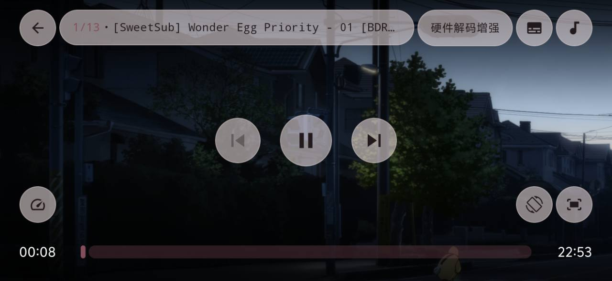
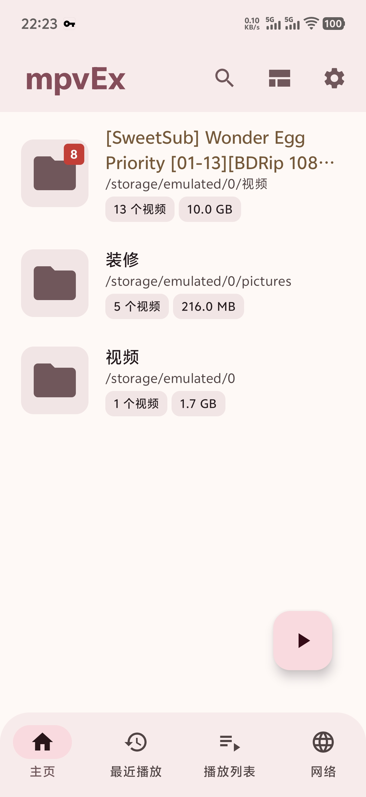
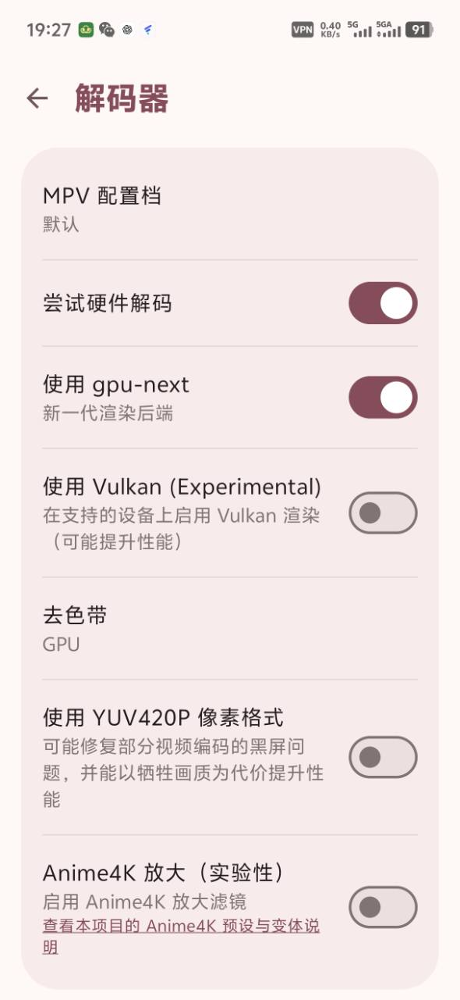
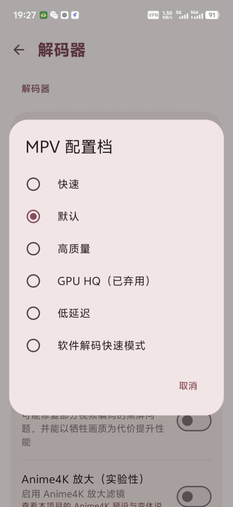
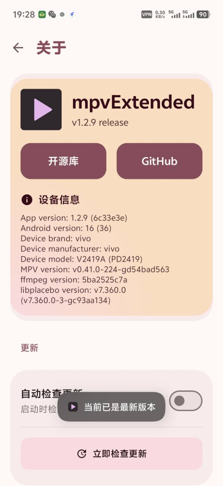

# mpvEx-CN（mpvExtended 简体中文维护版）
[](https://github.com/yaodao0yaodao/mpvEx-CN/releases/latest)
[](https://github.com/yaodao0yaodao/mpvEx-CN/releases/latest)

这是面向中文用户独立维护的 Android mpv/libmpv 开源视频播放器，源自 [marlboro-advance/mpvEx](https://github.com/marlboro-advance/mpvEx)，播放器内的软件名称仍为 **mpvEx**。项目提供完整简体中文界面、ARM64 APK、Anime4K/ArtCNN 放大、SDR→HDR 增强、智能播放保护、字幕轨标题智能匹配等实用改进。

ArtCNN、SDR→HDR 增强、智能渲染后端及部分播放性能保护的设计与实现参考并适配自 [Riteshp2001/mpvRx](https://github.com/Riteshp2001/mpvRx)。由于两个项目的代码结构不同，本项目采用了独立适配；温控判断按 Android 官方 API 的数值含义重新实现，并非直接复制。

- **汉化日期：** 2026-08-19
- **汉化时版本：** v1.2.9
- **当前中文版版本：** v1.3.1
- **独立包名：** `io.github.yaodao0yaodao.mpvex`，可与上游版本同时安装
- **构建架构：** 仅提供 `arm64-v8a`
- **附加改动：** 画面比例永久保存；字幕轨标题智能选择；音量调节优化；可靠缩略图；ArtCNN；播放中永久保存的 SDR→HDR 增强控件；智能渲染后端；自适应播放位置轮询；4K/8K Anime4K 保护；温控与帧压保护；无声无首帧泄漏的历史进度续播；应用内更新指向本项目 Releases
- **上游同步：** GitHub Actions 每日自动合并上游 `master`，随后构建 ARM64 APK；检测到上游正式版本时自动发布 Release

## 项目简介

mpvExtended 是基于 libmpv 的 Android 视频播放器，源自 [mpv-android](https://github.com/mpv-android/mpv-android)。它把 mpv 强大的格式兼容性、渲染与脚本能力，整合到适合触屏操作的 Material 3 界面中，支持硬件/软件解码、字幕与外部音轨、画中画、后台播放、网络串流、SMB/FTP/WebDAV、播放列表、逐帧导航和画面缩放等功能。

本仓库重点维护完整的简体中文界面。若发现漏译、术语错误或上游同步造成的界面回退，请在本项目的 [Issues](https://github.com/yaodao0yaodao/mpvEx-CN/issues) 中反馈，并附上界面路径和截图。

### 维护定位

本项目希望保持播放器简单、稳定，不以增加大量界面自定义选项为目标。维护重点是让软件在中文环境下更易理解、更顺手，并选择性加入确实有助于播放体验、兼容性、性能或功耗的实用功能。

这也是本项目与 [Riteshp2001/mpvRx](https://github.com/Riteshp2001/mpvRx) 的定位差异：我们会参考并适配其中合适的播放功能，但不会继续移植主题、布局等 UI 自定义体系。对界面外观和布局自定义有较高要求的用户，建议直接使用功能更丰富的 [mpvRx](https://github.com/Riteshp2001/mpvRx)。

## 中文版增强

- 字幕“首选语言”默认使用 `特效,Simplified,chs,CN,简,ch,zh,中`，逐级匹配字幕轨标题；完全没有标题命中时仍按语言代码回退。
- 在线字幕搜索默认选择 Chinese。
- Anime4K 实验性放大功能提供独立的[预设与变体中文说明](docs/Anime4K.zh-CN.md)。
- Anime4K 新增 ArtCNN 固定模型。播放器不再提供 PQ、HLG、BT.2020、Linear 等手动 HDR 模式：原生 HDR 交给 mpv 自动处理，唯一可调功能是播放界面中的 SDR→HDR 增强。该控件会永久保存选择，不再与解码器设置页维护两套开关。
- 历史进度会在 `loadfile` 时直接作为起始位置交给 mpv，避免先播放文件开头再跳转造成的首帧和短暂声音泄漏；切集时复用 HDR 与着色器状态，减少重复重建渲染管线。
- 播放器根据控件可见性和暂停状态降低位置查询频率，减少不必要的 JNI 唤醒。
- 4K/8K 视频从底层禁用 Anime4K；普通 Anime4K 可在温控或持续帧压力下临时降档，ArtCNN 只会临时关闭或恢复，不会替换为其他预设。
- Vulkan 设置下方提供[解码器与省电配置中文说明](docs/Decoder-and-Battery.zh-CN.md)，帮助在画质、性能和续航之间取舍。
- MPV 配置档中的 `GPU HQ` 已由 mpv 弃用，界面明确标记为“GPU HQ（已弃用）”。

## 上游介绍

**mpvExtended is a fork of [mpv-android](https://github.com/mpv-android/mpv-android), built on the libmpv library. It aims
to combine the powerful features of mpv with an easy to use interface and additional
features.**

- Simpler and Easier to Use UI
- Material3 Expressive Design
- Advanced Configuration and Scripting
- Enhanced Playback Features
- Picture-in-Picture (PiP)
- Background Playback
- High-Quality Rendering
- Network Streaming
- File Management
- Completely free and open source and without any ads or excessive permissions
- Media picker with tree and folder view modes
- External Subtitle support
- Zoom gesture
- External Audio support
- Search Functionality
- SMB/FTP/WebDAV support
- Custom Playlist management support

**This project is still in development and is expected to have bugs. Please report any bugs you find in
the [upstream Issues](https://github.com/marlboro-advance/mpvEx/issues) section.**

---

## Installation

### Stable Release
从本项目的 [GitHub Releases](https://github.com/yaodao0yaodao/mpvEx-CN/releases) 下载最新的已签名 ARM64 APK。

[](https://github.com/yaodao0yaodao/mpvEx-CN/releases/latest)

> 本项目使用独立包名和签名，不能覆盖安装上游版本；两者可以共存。

---

## 界面预览
<div class="image-row" align="center">
  
</div>

<div class="image-row" align="center" justify-content="space-between">
  
  
  
  
</div>

---

## Building

### Prerequisites

- JDK 17
- Android SDK with build tools 34.0.0+
- Git (for version information in builds)

### APK Variant

This fork builds only **arm64-v8a**, for modern 64-bit ARM Android devices.

---

## Releases

### Setting Up Release Signing

To enable automatic signing for release builds in GitHub Actions, you need to configure the
following secrets in your GitHub repository:

1. Navigate to your repository on GitHub
2. Go to **Settings** → **Secrets and variables** → **Actions**
3. Add the following repository secrets:

| Secret Name              | Description                                          |
|--------------------------|------------------------------------------------------|
| `SIGNING_KEYSTORE`       | Base64-encoded keystore file (`.jks` or `.keystore`) |
| `SIGNING_KEY_ALIAS`      | The alias name used when creating the keystore       |
| `SIGNING_STORE_PASSWORD` | Password for the keystore file                       |
| `KEY_PASSWORD`           | Password for the key (can be same as store password) |

#### Encoding Your Keystore

To encode your keystore file to base64:

**Linux/macOS:**

```bash
base64 -i your-keystore.jks | tr -d '\n' > keystore.txt
```

**Windows (PowerShell):**

```powershell
[Convert]::ToBase64String([IO.File]::ReadAllBytes("your-keystore.jks")) | Out-File -FilePath keystore.txt -NoNewline
```

Copy the contents of `keystore.txt` and paste it as the value for the `SIGNING_KEYSTORE` secret.

### Creating a Release

1. 发布标签必须与应用的 `versionName` 完全一致；修复版本递增补丁号（例如 `1.3.0` → `1.3.1`）
2. Commit the changes
3. Create and push a tag:
   ```bash
   git tag -a v1.0.0 -m "Release version 1.0.0"
   git push origin v1.0.0
   ```
4. GitHub Actions will automatically build and sign the ARM64 APK, generate its SHA-256 checksum, and publish the stable release

### Creating a Preview Release

1. Create and push a preview tag:
   ```bash
   git tag -a v1.0.0-preview.1 -m "Preview release"
   git push origin v1.0.0-preview.1
   ```
2. GitHub Actions will create a pre-release automatically

---

## Acknowledgments

- [mpv-android](https://github.com/mpv-android)
- [mpvKt](https://github.com/abdallahmehiz/mpvKt)
- [Next player](https://github.com/anilbeesetti/nextplayer)
- [Gramophone](https://github.com/FoedusProgramme/Gramophone)
- [mpvRx](https://github.com/Riteshp2001/mpvRx)（ArtCNN、SDR→HDR 增强及部分性能功能参考实现）

---

## Support the Project 

If you find mpvExtended useful, consider supporting the development:

[](upi://pay?pa=aadiinarvekar@upi)

---
## Star History 

<a href="https://www.star-history.com/#marlboro-advance/mpvEx&type=date&legend=top-left">
 <picture>
   <source media="(prefers-color-scheme: dark)" srcset="https://api.star-history.com/svg?repos=marlboro-advance/mpvEx&type=date&theme=dark&legend=top-left" />
   <source media="(prefers-color-scheme: light)" srcset="https://api.star-history.com/svg?repos=marlboro-advance/mpvEx&type=date&legend=top-left" />
   
 </picture>
</a>
